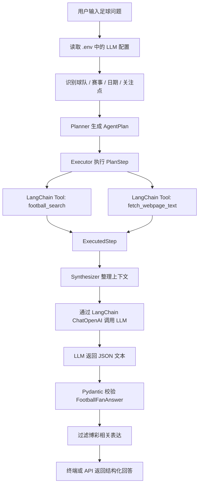
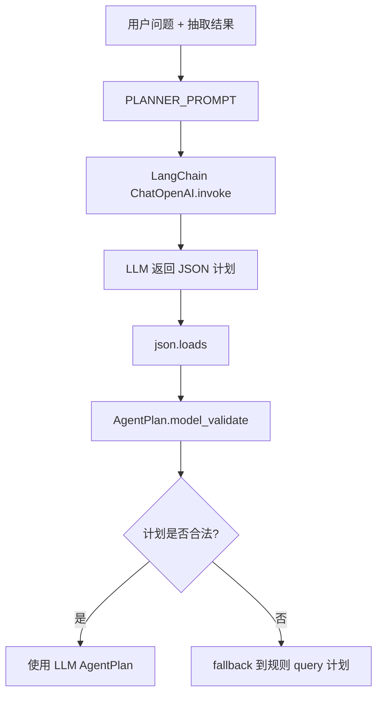
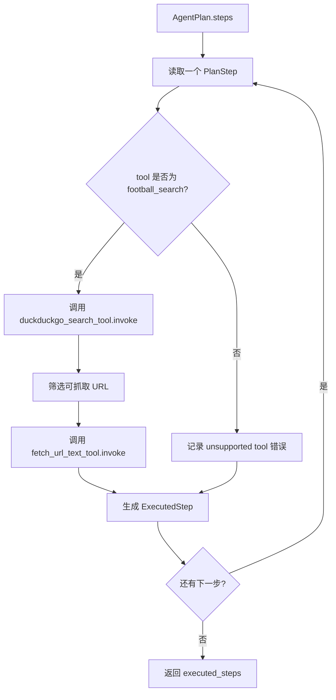
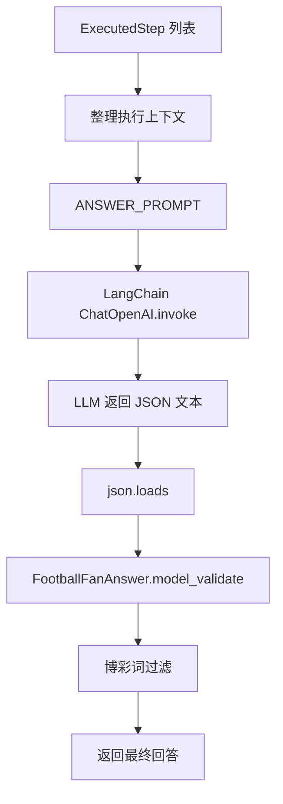
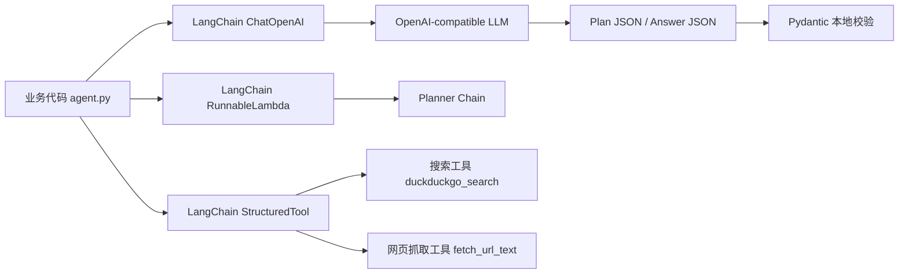
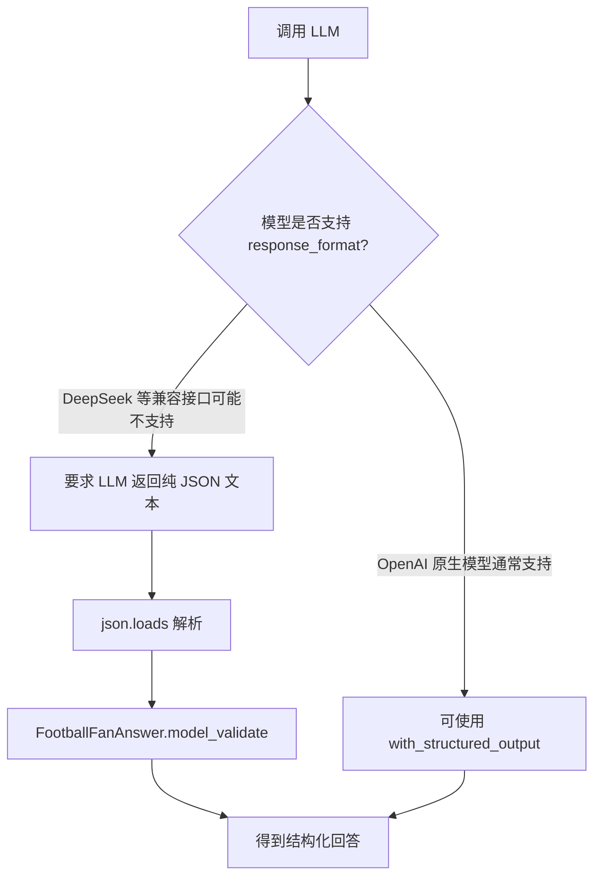
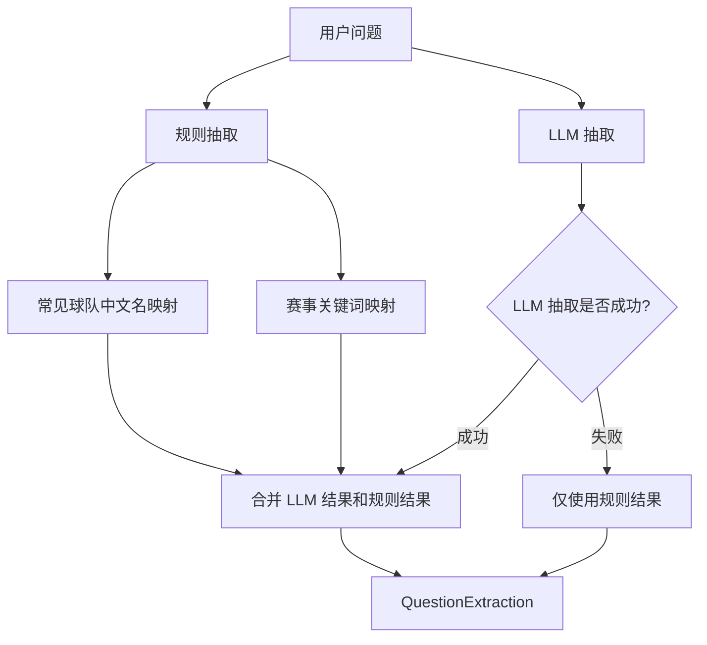
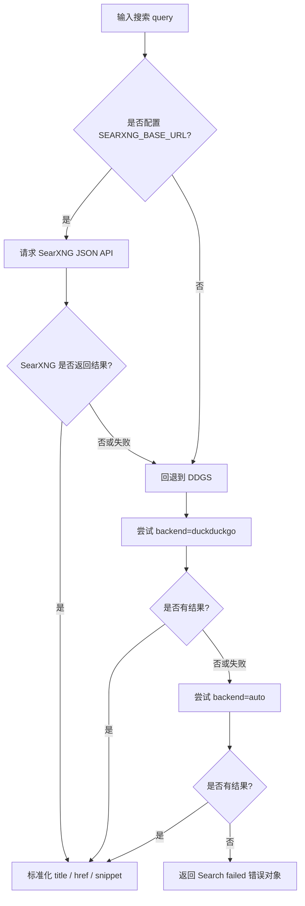
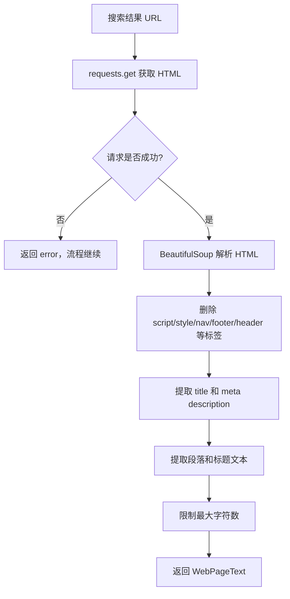
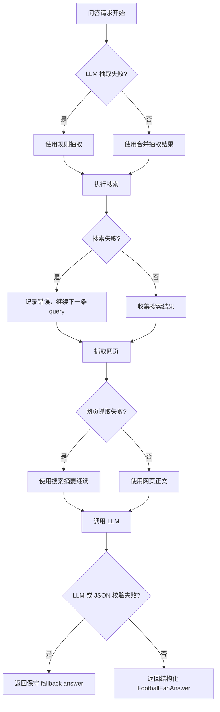

# 足球球迷问答 Agent 技术文档

## 1. 项目概述

本项目是一个基于 Python、LangChain、FastAPI 和搜索工具构建的足球球迷问答 Agent MVP。

当前版本采用 **Plan-and-Execute** 范式：

```text
Planner 负责制定检索计划
Executor 负责逐步调用工具执行计划
Synthesizer 负责基于执行材料生成最终回答
```

它面向赛前/赛后足球问答场景，帮助用户理解：

- 球队近期状态
- 伤病和停赛
- 预计首发
- 关键球员
- 战术看点
- 历史交锋
- 可能比赛走势

项目定位是“球迷信息问答助手”，不是足彩、投注或赔率分析工具。系统提示词中明确禁止输出下注、盘口、赔率、稳赢、必胜等博彩相关表达。

## 2. 技术栈

主要技术组件：

```text
Python
LangChain
langchain-openai
FastAPI
Pydantic
python-dotenv
requests
beautifulsoup4
DDGS / SearXNG
本地 JSON TTL 缓存
```

其中 LangChain 主要用于：

- 统一封装 OpenAI-compatible LLM 调用。
- 通过 `ChatOpenAI` 接入 OpenAI、DeepSeek 等兼容接口。
- 使用 message 格式组织 system prompt 和 human prompt。
- 使用 `RunnableLambda` 组合 Planner Chain。
- 使用 `StructuredTool` 封装搜索和网页抓取工具。
- 配合 Pydantic 完成结构化结果校验。
- 让 Agent 主流程更接近 Plan-and-Execute 架构。

## 3. 项目结构

```text
football_fan_agent/
  app/
    main.py
    cli.py
    agent.py
    prompts.py
    schemas.py
    tools/
      duckduckgo.py
      webpage.py
    services/
      cache.py
      extractor.py
      query_builder.py
  requirements.txt
  run_cli.ps1
  run_server.ps1
  .env.example
  README.md
  技术文档.md
```

各文件职责如下：

| 文件 | 作用 |
|---|---|
| `app/cli.py` | 终端交互入口，用户自由输入问题 |
| `app/main.py` | FastAPI 服务入口，提供 `/health` 和 `/ask` |
| `app/agent.py` | 主流程编排，负责识别、搜索、抓取、调用 LLM、生成答案 |
| `app/prompts.py` | LLM system prompt、抽取 prompt、Planner prompt、回答 prompt |
| `app/schemas.py` | Pydantic 请求、响应、抽取结果、计划和执行结果数据结构 |
| `app/tools/duckduckgo.py` | 搜索工具，支持 SearXNG 优先、DDGS fallback |
| `app/tools/webpage.py` | 网页正文抓取和 HTML 清洗 |
| `app/services/cache.py` | 本地 JSON TTL 缓存 |
| `app/services/extractor.py` | 用户问题中的球队、赛事、日期、关注点抽取 |
| `app/services/query_builder.py` | 固定搜索 query 生成器 |
| `run_cli.ps1` | Windows 终端交互启动脚本 |
| `run_server.ps1` | FastAPI 服务启动脚本 |

## 4. 整体工作流程

一次问答的完整流程如下：

```text
用户输入问题
  ↓
读取 LLM 配置
  ↓
识别球队、赛事、日期、关注点
  ↓
Planner 生成 AgentPlan
  ↓
Executor 逐步调用 LangChain Tools
  ↓
收集 search results 和 fetched pages
  ↓
Synthesizer 合并执行材料
  ↓
调用 LLM 生成 JSON 回答
  ↓
Pydantic 校验结构
  ↓
过滤博彩相关表达
  ↓
终端或 API 返回 FootballFanAnswer
```

对应流程图：



项目不再只是固定 workflow，而是拆成了 Plan-and-Execute 三段：

- Planner：根据问题生成可执行检索计划。
- Executor：按计划调用搜索和网页抓取工具。
- Synthesizer：基于执行材料生成结构化回答。

同时项目仍保留规则 fallback。如果 Planner 返回异常，系统会退回到固定 query 生成器，保证稳定性。

## 5. Plan-and-Execute Agent 设计

### 5.1 Planner

Planner 的职责是把用户问题转成 `AgentPlan`。

位置：

```text
app/agent.py
app/prompts.py
app/schemas.py
```

核心模型：

```python
class AgentPlan(BaseModel):
    objective: str
    teams: list[str]
    competition: str | None
    assumptions: list[str]
    steps: list[PlanStep]
    answer_strategy: str
```

每个 `PlanStep` 是一次可执行工具调用：

```python
class PlanStep(BaseModel):
    id: str
    tool: str
    purpose: str
    query: str
    max_results: int
    fetch_top_n: int
```

Planner 使用 LangChain `RunnableLambda` 串起：

```text
LLM invoke
  ↓
JSON parse
  ↓
AgentPlan.model_validate
```

流程图：



### 5.2 Executor

Executor 的职责是按计划执行工具。

当前支持的工具：

```text
football_search
fetch_webpage_text
```

工具通过 LangChain `StructuredTool` 封装，然后在 Executor 中调用：

```python
duckduckgo_search_tool.invoke({
    "query": step.query,
    "max_results": step.max_results,
})
```

网页抓取工具：

```python
fetch_url_text_tool.invoke({
    "url": url,
    "max_chars": 8000,
})
```

执行结果保存为：

```python
class ExecutedStep(BaseModel):
    id: str
    purpose: str
    query: str
    search_results: list[dict]
    fetched_pages: list[dict]
    errors: list[str]
```

Executor 流程图：



### 5.3 Synthesizer

Synthesizer 的职责是把执行材料变成最终答案。

它接收：

- 用户问题
- 抽取信息
- AgentPlan
- ExecutedStep 列表整理出的上下文
- sources URL

然后通过 LangChain `ChatOpenAI.invoke` 调用模型，要求模型返回纯 JSON。

最后使用：

```python
FootballFanAnswer.model_validate(data)
```

校验结构。

Synthesizer 流程图：



## 6. LangChain 的使用方式

LangChain 在本项目中的位置可以概括为：



当前 MVP 没有使用完全自由的 ReAct Agent，而是使用 Plan-and-Execute。这样既能体现 Agent 的规划和执行，又能控制足球问答的检索范围。

### 6.1 使用 `ChatOpenAI` 接入模型

项目通过 `langchain-openai` 提供的 `ChatOpenAI` 创建 LLM 客户端。

位置：

```text
app/agent.py
```

核心逻辑：

```python
from langchain_openai import ChatOpenAI

ChatOpenAI(
    model=model,
    api_key=api_key,
    base_url=base_url,
    temperature=0.2,
    timeout=timeout,
    max_retries=2,
)
```

这里的 `base_url` 允许接入 OpenAI-compatible 服务，例如：

- OpenAI
- DeepSeek
- 其他兼容 OpenAI Chat Completions 格式的模型服务

项目同时支持两套环境变量：

```env
OPENAI_API_KEY=
OPENAI_MODEL=
OPENAI_BASE_URL=
```

以及：

```env
LLM_API_KEY=
LLM_MODEL_ID=
LLM_BASE_URL=
```

### 6.2 使用 LangChain message 调用模型

项目调用 LLM 时使用 LangChain 的 message 格式：

```python
response = llm.invoke(
    [
        ("system", SYSTEM_PROMPT),
        ("human", ANSWER_PROMPT.format(...)),
    ]
)
```

其中：

- `system` 消息定义 Agent 的角色、边界和禁止事项。
- `human` 消息包含用户问题、识别结果、搜索材料和输出格式要求。

这种方式比单纯拼接字符串更清晰，也更符合 Chat Model 的调用方式。

### 6.3 为什么没有继续使用 `with_structured_output`

最初版本使用过：

```python
llm.with_structured_output(FootballFanAnswer)
```

这是 LangChain 提供的结构化输出能力。它在 OpenAI 原生模型上通常很好用，但部分 OpenAI-compatible 服务并不支持对应的 `response_format` 参数。

例如 DeepSeek 兼容接口可能返回：

```text
This response_format type is unavailable now
```

因此项目改成了更通用的方式：

1. 在 prompt 中要求 LLM 返回纯 JSON。
2. 使用普通 `llm.invoke(...)`。
3. 本地用 `json.loads` 解析。
4. 再用 Pydantic 的 `FootballFanAnswer.model_validate(...)` 校验。

这样保留了结构化输出的效果，同时兼容更多模型服务。

结构化输出兼容方案如下：



### 6.4 LangChain Tool 封装

搜索函数被封装成 LangChain Tool：

```python
duckduckgo_search_tool = StructuredTool.from_function(
    func=duckduckgo_search,
    name="duckduckgo_football_search",
    description="Search football news, injuries, suspensions, lineups, previews, and tactics.",
    args_schema=DuckDuckGoSearchInput,
)
```

网页抓取函数也封装成 Tool：

```python
fetch_url_text_tool = StructuredTool.from_function(
    func=fetch_url_text,
    name="fetch_webpage_text",
    description="抓取网页正文并清洗 HTML，用于补充 DuckDuckGo 摘要。",
    args_schema=FetchUrlInput,
)
```

当前 MVP 主流程没有让 Agent 自由选择工具，而是由 `agent.py` 固定编排工具调用。

这样设计的原因：

- MVP 更可控。
- 日志更清晰。
- 搜索覆盖面更稳定。
- 避免 Agent 乱搜或漏搜。

后续如果要升级成真正的 LangChain Agent，可以复用这些 Tool。

## 7. 信息抽取流程

用户输入通常是中文自然语言，例如：

```text
怎么看待切尔西和曼城的足总杯决赛
```

系统需要识别：

- 球队：Chelsea、Manchester City
- 赛事：FA Cup
- 关注点：match preview、recent form、key players 等

抽取逻辑在：

```text
app/services/extractor.py
```

它采用“双层方案”：

1. 规则抽取。
2. LLM 结构化抽取。

规则抽取会识别常见中文球队名，例如：

```python
"切尔西": "Chelsea"
"曼城": "Manchester City"
"阿森纳": "Arsenal"
"拜仁": "Bayern Munich"
```

LLM 抽取用于补充复杂表达。

如果 LLM 抽取失败，系统会回退到规则抽取结果，不会中断整个流程。

信息抽取流程图：



## 8. 搜索 Query 生成

搜索 query 生成逻辑在：

```text
app/services/query_builder.py
```

如果识别到两支球队，例如：

```text
Manchester City
Chelsea
FA Cup
```

会生成类似：

```text
Manchester City latest team news injuries suspension
Chelsea latest team news injuries suspension
Manchester City vs Chelsea match preview FA Cup
Manchester City vs Chelsea expected lineups
Manchester City vs Chelsea tactical analysis
Manchester City vs Chelsea head to head
Manchester City recent form
Chelsea recent form
```

这样可以稳定覆盖：

- 球队新闻
- 伤病
- 停赛
- 预计首发
- 赛前分析
- 战术分析
- 交锋记录
- 近期状态

## 9. 搜索工具设计

搜索工具在：

```text
app/tools/duckduckgo.py
```

虽然文件名叫 `duckduckgo.py`，但现在实际上支持两种搜索来源：

1. SearXNG
2. DDGS

### 8.1 SearXNG 优先

如果 `.env` 配置了：

```env
SEARXNG_BASE_URL=http://127.0.0.1:8080
```

系统会优先请求：

```text
{SEARXNG_BASE_URL}/search?q=...&format=json
```

SearXNG 的优点：

- 开源。
- 可自托管。
- 搜索来源可控。
- 不强依赖某个第三方 Python 搜索包。

### 8.2 DDGS fallback

如果 SearXNG 没有配置、请求失败或无结果，系统会回退到 DDGS。

DDGS 会尝试：

```text
backend="duckduckgo"
backend="auto"
```

如果搜索失败，函数不会抛出异常导致服务崩溃，而是返回：

```json
{
  "title": "Search failed",
  "href": "",
  "snippet": "",
  "error": "Search request failed: ..."
}
```

主流程会把错误显示到终端日志里，并继续处理后续 query。

搜索 fallback 流程图：



## 10. 网页正文抓取

搜索结果通常只有标题、摘要和链接。为了让 LLM 获得更多上下文，项目会尝试抓取部分网页正文。

位置：

```text
app/tools/webpage.py
```

抓取逻辑：

1. 使用 `requests.get(...)` 请求网页。
2. 设置 User-Agent。
3. 使用 BeautifulSoup 解析 HTML。
4. 删除无关标签：

```text
script
style
nav
footer
header
aside
form
noscript
```

5. 提取标题、meta description、段落和部分标题文本。
6. 限制最大字符数，默认 8000。

如果网页抓取失败，会返回错误信息，但不会中断流程。

网页抓取和清洗流程图：



## 11. 缓存机制

缓存逻辑在：

```text
app/services/cache.py
```

缓存类型：

- 搜索 query 结果缓存。
- URL 网页正文缓存。

默认 TTL：

```text
6 小时
```

可通过环境变量调整：

```env
FOOTBALL_AGENT_CACHE_TTL_SECONDS=21600
```

缓存文件默认：

```env
FOOTBALL_AGENT_CACHE_PATH=.cache/football_agent_cache.json
```

缓存的作用：

- 减少重复访问搜索引擎。
- 减少重复抓网页。
- 提高二次提问速度。

## 12. 输出结构

最终输出模型定义在：

```text
app/schemas.py
```

核心模型：

```python
class FootballFanAnswer(BaseModel):
    short_answer: str
    match: str | None
    teams: list[str]
    competition: str | None
    confirmed_facts: list[str]
    likely_but_uncertain: list[str]
    team_a_strengths: list[str]
    team_a_concerns: list[str]
    team_b_strengths: list[str]
    team_b_concerns: list[str]
    key_players: list[str]
    tactical_focus: list[str]
    likely_game_flow: str
    fan_takeaway: str
    sources: list[str]
    uncertainty_note: str
```

这个结构的目的：

- 让回答不是一大段散文。
- 明确区分确认信息和不确定信息。
- 保留来源 URL。
- 方便未来接入前端、数据库或其他系统。

## 13. 终端交互模式

终端入口在：

```text
app/cli.py
```

启动方式：

```powershell
cd F:\足球问答\football_fan_agent
.\run_cli.ps1
```

终端会显示：

- LLM API key 是否读取到。
- 当前模型名。
- Base URL。
- 是否测试 LLM 连接。
- 每一步后端流程进度。

示例日志：

```text
[12:24:43] 读取 LLM 配置
[12:24:43] 识别球队、赛事和关注点
[12:24:44] 识别结果：teams=['Manchester City', 'Chelsea'], competition=FA Cup
[12:24:44] 生成 8 条搜索 query
[12:24:44] 搜索 1/8：Manchester City latest team news injuries suspension
[12:24:49] 选择 0 个网页抓取正文
[12:24:49] 合并搜索摘要和网页正文
[12:24:49] 调用 LLM 生成 JSON 回答
[12:24:50] 回答生成完成
```

这种设计方便定位问题：

- 卡在搜索，就是搜索层或网络问题。
- 卡在网页抓取，就是目标网页响应慢。
- 卡在 LLM，就是模型接口问题。
- JSON 校验失败，就是模型没有按要求返回结构。

## 14. FastAPI 接口

API 入口在：

```text
app/main.py
```

启动方式：

```powershell
.\run_server.ps1
```

健康检查：

```http
GET /health
```

问答接口：

```http
POST /ask
```

请求体：

```json
{
  "question": "怎么看待切尔西和曼城的足总杯决赛"
}
```

响应体就是 `FootballFanAnswer`。

当前项目已删除浏览器 GUI，只保留 API 和终端交互。

## 15. 异常处理设计

项目的异常处理原则是：

```text
单个环节失败，不让整个服务崩溃。
```

具体策略：

- LLM 抽取失败：回退到规则抽取。
- 搜索失败：返回错误结果并继续下一条 query。
- 网页抓取失败：使用搜索摘要继续生成回答。
- LLM 生成失败：返回保守 fallback answer。
- LLM JSON 解析失败：返回保守 fallback answer。

这保证了用户至少能看到清晰错误，而不是程序直接退出或一直无响应。

异常降级流程图：



## 16. 重要安全边界

系统提示词要求模型不能输出：

- 下注建议
- 盘口分析
- 赔率推荐
- 稳赢、必胜、稳赚等表达
- 没有来源支持的确定性结论

同时 `agent.py` 中还有一层简单文本过滤：

```python
FORBIDDEN_TERMS = [
    "稳赢",
    "必胜",
    "稳赚",
    "下注",
    "盘口",
    "赔率",
    "稳胆",
    "买入",
    "重仓",
]
```

如果最终回答中出现这些词，会被替换成：

```text
[已移除的不适当表述]
```

## 17. 后续可扩展方向

后续可以继续增强：

- 增加更多球队中文名映射。
- 增加赛事赛程识别。
- 接入可靠体育新闻源白名单。
- 引入来源可信度排序。
- 使用 SearXNG 自托管搜索服务。
- 增加 SQLite 缓存。
- 保存终端日志。
- 增加测试用例。
- 把 LangChain Tool 升级为真正的 Agent 工具调用。
- 为不同模型适配不同 JSON 输出策略。

## 18. 总结

这个 MVP 的核心思想是：

```text
固定检索流程保证覆盖面，
LangChain 统一调用 LLM，
Pydantic 保证输出结构，
搜索和网页抓取提供外部材料，
终端日志保证流程可观察。
```

它不是让 LLM 凭空回答，而是先检索资料，再让 LLM 基于材料进行中文总结和解释。
